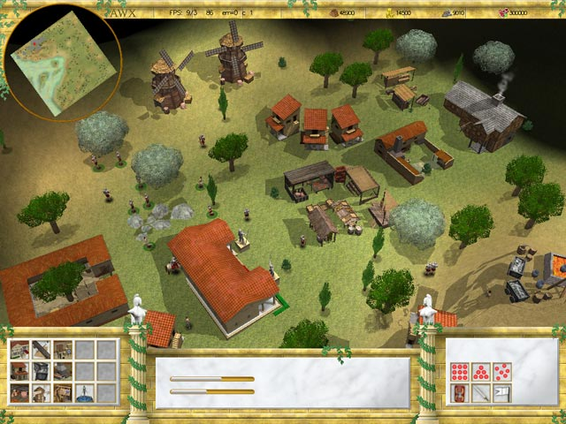
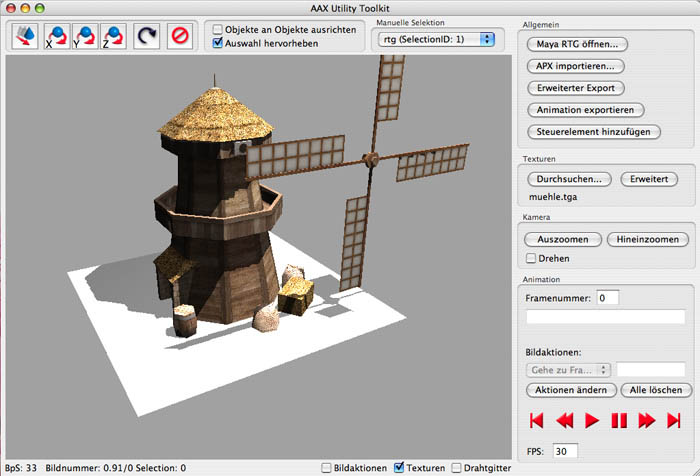
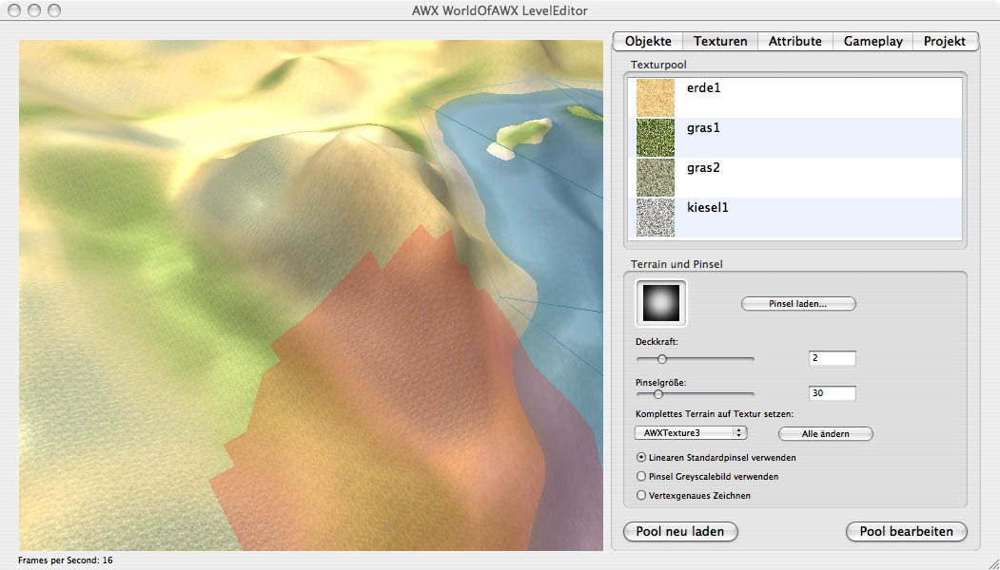
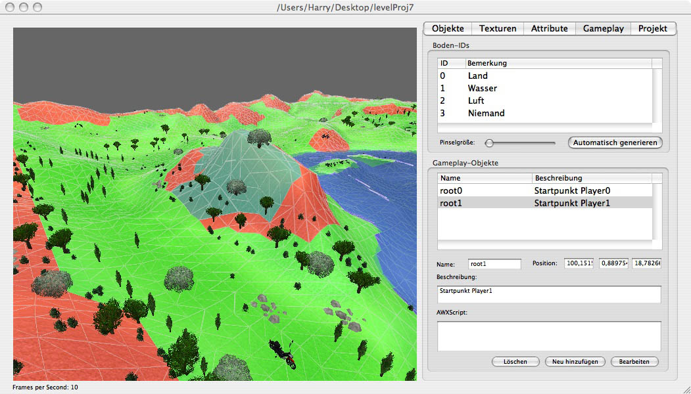
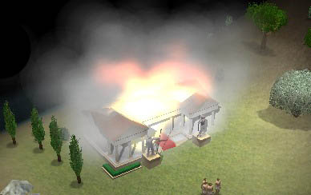

This project is a source drop of our ancient school project: Augustus (2005-2007)

Authors are:
Georg Haaser
Manuel Wieser
Harald Steinlechner

Complete Artwork and 3D design:
Manuel Wieser

More information is available here: http://augustus.awx.at

Keep in mind that those implementations are at least 7 years atm and our programming style
changed significantly ;)

It uses: freeglut, SDL 1.2, SDL_ttf for SDL 1.2

